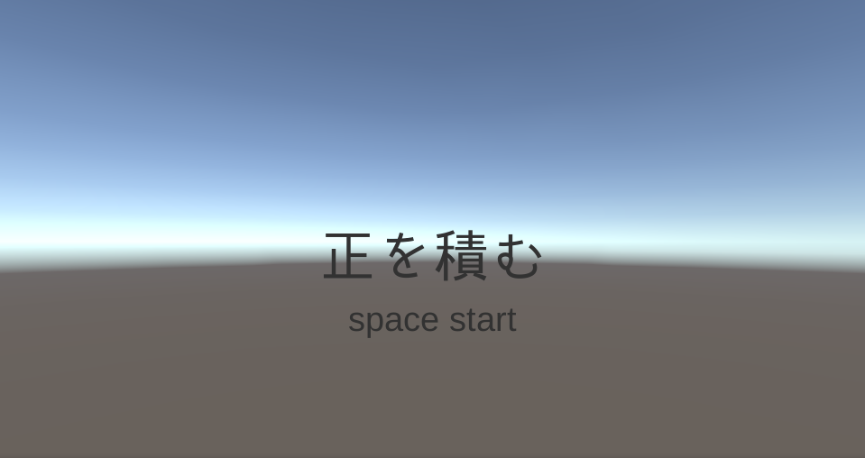

# Portfolio

- 宮沢　和樹
- 連絡先 Email (kazuki.dat2147@gmail.com)
- 専門学校デジタルアーツ東京 ゲームプログラムコース 2023年卒業予定

## 資格
-  情報処理技能検定(表計算3級)
-  プレゼンテーション検定3級
-  計算技能検定4級

## スキル
- C#
  - 利用歴1年
  - どの程度使えるか
- Unity
  - 利用歴1年
  - どの程度使えるか
- C/C++
  - 利用歴1年
  - どの程度使えるか

## 取り組んでいるテーマ
-  シューティングゲームのアニメーションや得点、キャラのデータ管理方法
-  弾幕の飛ばし方の処理
-  プレイヤーの死亡判定処理

## 作品リスト

### 作品名1

[正を積む](https://unityroom.com/games/sei_wotum)

作品概要

正を積んでいくゲームです。

- 開発環境：Unity
- 開発期間：1日

## 連絡先
- E-mail (kazuki.dat2147@gmail.com)
